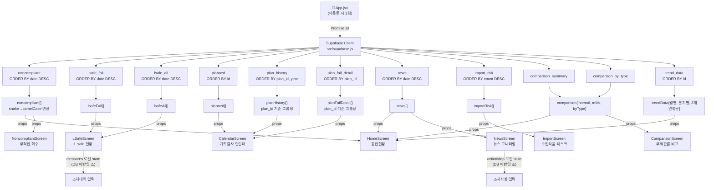
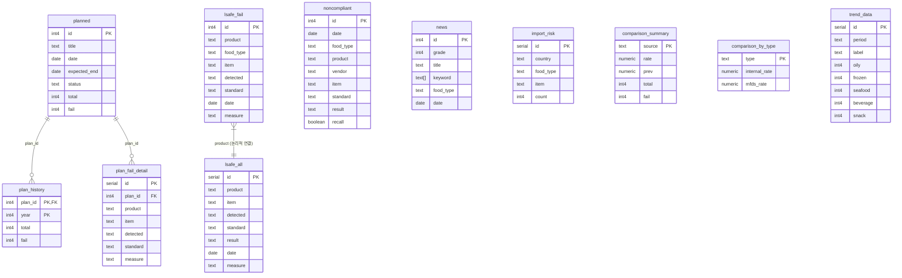

# DATA_FLOW_ANALYSIS.md
# food-safety-react 데이터 흐름 분석

> 분석 기준: 커밋 `2852ba1` / 작성일: 2026-06-05
> 대상 경로: `/Users/suminkim/Claude/food-safety-react/src/`

---

## 1. 전체 구조 요약

| 탭/페이지 | 화면 key | React 파일 | Hook | Supabase Table | 조회/수정 |
|---|---|---|---|---|---|
| ④ 종합 현황 | `home` | `HomeScreen.jsx` | useState | noncompliant, news, comparison_summary, comparison_by_type, trend_data | 읽기 |
| ① 기획검사 캘린더 | `calendar` | `CalendarScreen.jsx` | useState | planned, plan_history, plan_fail_detail | 읽기 |
| ② L.safe 현황 | `lsafe` | `LSafeScreen.jsx` | useState | lsafe_fail, lsafe_all | 읽기 (조치내역은 **로컬 state만**, DB 미반영) |
| ③ 부적합률 비교 | `comparison` | `ComparisonScreen.jsx` | useState | comparison_summary, comparison_by_type | 읽기 |
| ⑤ 부적합·회수 현황 | `noncompliant` | `NoncompliantScreen.jsx` | useState | noncompliant | 읽기 |
| ⑥ 수입식품 리스크 | `import` | `ImportScreen.jsx` | — | import_risk | 읽기 |
| ⑦ 뉴스 모니터링 | `news` | `NewsScreen.jsx` | useState | news | 읽기 (조치사항은 **로컬 state만**, DB 미반영) |
| ⑧ 알림 & 리포트 | `report` | (App.jsx 인라인) | — | — | 미구현 |

> **핵심 패턴**: 모든 Supabase fetch는 `App.jsx`의 단일 `Promise.all`에서 발생. 각 Screen은 순수 props 수신자.

---

## 2. 페이지별 상세 분석

---

### ④ 종합 현황 (HomeScreen)

| 항목 | 내용 |
|---|---|
| 화면 key | `home` |
| 진입 컴포넌트 | `src/components/HomeScreen.jsx` |
| 사용 Hook | `useState` (trendTab: "월별"\|"분기별"\|"3개년평균") |
| Props 수신 | `noncompliant[]`, `news[]`, `comparison{}`, `trendData{}` |

**Supabase Query (App.jsx에서 실행)**

```js
supabase.from("noncompliant").select("*").order("date", { ascending: false })
supabase.from("news").select("*").order("date", { ascending: false })
supabase.from("comparison_summary").select("*")
supabase.from("comparison_by_type").select("*")
supabase.from("trend_data").select("*").order("id")
```

**사용 테이블 및 컬럼**

| 테이블 | 사용 컬럼 | 용도 |
|---|---|---|
| `noncompliant` | date, food_type, recall | 오늘 부적합·진행 중 회수 KPI 카드 |
| `noncompliant` | id, date, food_type, product, vendor, item, recall | 최신 목록 테이블 (상위 6건) |
| `news` | grade, date, title, keyword, food_type | 이번주 주의 기사 KPI + 최고등급 뉴스 |
| `comparison_summary` | source, rate, prev | 내부 vs 식약처 부적합률 KPI |
| `comparison_by_type` | — | (HomeScreen에서는 직접 미사용, comparison 객체로 전달) |
| `trend_data` | period, label, oily, frozen, seafood, beverage, snack | 식품유형별 트렌드 바 차트 |

**클라이언트 필터 조건**
- 오늘 부적합: `date === "2026-05-28"` ← **하드코딩** ⚠️
- 진행 중 회수: `recall === true && date !== "2026-05-28"`
- 이번주 뉴스: `grade >= 3 && diff <= 7` (기준일 `"2026-05-28"` 하드코딩) ⚠️

**INSERT/UPDATE/DELETE**: 없음

---

### ① 기획검사 캘린더 (CalendarScreen)

| 항목 | 내용 |
|---|---|
| 화면 key | `calendar` |
| 진입 컴포넌트 | `src/components/CalendarScreen.jsx` |
| 사용 Hook | `useState` (selected: 선택된 검사 항목) |
| Props 수신 | `planned[]`, `planHistory{}`, `planFailDetail{}` |

**Supabase Query**

```js
supabase.from("planned").select("*").order("id")
supabase.from("plan_history").select("*").order("plan_id").order("year")
supabase.from("plan_fail_detail").select("*").order("plan_id")
```

**사용 테이블 및 컬럼**

| 테이블 | 사용 컬럼 | 용도 |
|---|---|---|
| `planned` | id, title, date, expected_end, status, total, fail | 검사 일정 목록 카드 |
| `plan_history` | plan_id, year, total, fail | 선택 항목의 연도별 비교 테이블 |
| `plan_fail_detail` | plan_id, product, item, detected, standard, measure | 선택 항목의 부적합 내역 카드 |

**App.jsx 데이터 변환 (plan_history, plan_fail_detail)**
```js
// plan_history: 배열 → { [plan_id]: [{year, total, fail}] } 객체로 변환
// plan_fail_detail: 배열 → { [plan_id]: [{product, item, detected, standard, measure}] } 변환
```

**정렬 조건**: planned → id ASC, plan_history → plan_id ASC + year ASC

**INSERT/UPDATE/DELETE**: 없음

---

### ② L.safe 현황 (LSafeScreen)

| 항목 | 내용 |
|---|---|
| 화면 key | `lsafe` |
| 진입 컴포넌트 | `src/components/LSafeScreen.jsx` |
| 사용 Hook | `useState` (historyModal, measures, filter) |
| Props 수신 | `lsafeFail[]`, `lsafeAll[]` |

**Supabase Query**

```js
supabase.from("lsafe_fail").select("*").order("date", { ascending: false })
supabase.from("lsafe_all").select("*").order("date", { ascending: false })
```

**사용 테이블 및 컬럼**

| 테이블 | 사용 컬럼 | 용도 |
|---|---|---|
| `lsafe_fail` | id, product, food_type, item, detected, standard, date, measure | 부적합 목록 테이블 |
| `lsafe_all` | product, item, detected, standard, result, date, measure | 이력 팝업 모달 |

**클라이언트 필터 조건**
- 제품명 텍스트 검색 (`product.includes(filter.product)`)
- 식품유형 select 필터 (`food_type === filter.foodType`)
- lsafe_all 이력 조회: `product`로 클라이언트 매칭 후 date DESC 정렬

**⚠️ 미반영 Write 작업**
- `measures` state: 조치내역 input `onBlur` 값 → **로컬 state만 저장, Supabase UPDATE 없음**

**INSERT/UPDATE/DELETE**: 없음 (조치내역 미반영)

---

### ③ 부적합률 비교 (ComparisonScreen)

| 항목 | 내용 |
|---|---|
| 화면 key | `comparison` |
| 진입 컴포넌트 | `src/components/ComparisonScreen.jsx` |
| 사용 Hook | `useState` (drillModal) |
| Props 수신 | `comparison{ internal, mfds, byType }` |

**Supabase Query**

```js
supabase.from("comparison_summary").select("*")
supabase.from("comparison_by_type").select("*")
```

**사용 테이블 및 컬럼**

| 테이블 | 사용 컬럼 | 용도 |
|---|---|---|
| `comparison_summary` | source, rate, prev, total, fail | 내부/식약처 KPI 카드 2개 |
| `comparison_by_type` | type, internal_rate, mfds_rate | 식품유형별 비교 가로 바 차트 |

**⚠️ 하드코딩 데이터**
```js
// ComparisonScreen.jsx 내부에 drillData 하드코딩
const drillData = { 유지류: [...], 수산물: [...], ... }
// 드릴다운 모달에 사용되는 시험항목별 건수 → DB 미연동
```

**INSERT/UPDATE/DELETE**: 없음

---

### ⑤ 부적합·회수 현황 (NoncompliantScreen)

| 항목 | 내용 |
|---|---|
| 화면 key | `noncompliant` |
| 진입 컴포넌트 | `src/components/NoncompliantScreen.jsx` |
| 사용 Hook | `useState` (ftFilter, recFilter, activeTab, typeModal, heatModal) |
| Props 수신 | `noncompliant[]` |

**Supabase Query**

```js
supabase.from("noncompliant").select("*").order("date", { ascending: false })
```

**사용 테이블 및 컬럼**

| 테이블 | 사용 컬럼 | 용도 |
|---|---|---|
| `noncompliant` | id, date, food_type, product, vendor, item, result, standard, recall | 전체 목록 테이블 |
| `noncompliant` | food_type, item | 위험식품유형 바 차트, 히트맵 |
| `noncompliant` | food_type | 전년대비증가 (currYear 집계) |
| `noncompliant` | vendor, id, date, food_type, product, item, recall | 반복위반업체 |

**클라이언트 필터/집계 조건**
- 식품유형 select 필터
- 회수여부 select 필터 (`recall` boolean)
- 전년대비: `prevYear` 하드코딩 ⚠️ `{ 유지류:6, 냉동식품:4, 수산물:3, 음료류:2, 과자류:2 }`
- 반복위반업체: vendor 기준 2건 이상 필터

**INSERT/UPDATE/DELETE**: 없음

---

### ⑥ 수입식품 리스크 (ImportScreen)

| 항목 | 내용 |
|---|---|
| 화면 key | `import` |
| 진입 컴포넌트 | `src/components/ImportScreen.jsx` |
| 사용 Hook | 없음 |
| Props 수신 | `importRisk[]` |

**Supabase Query**

```js
supabase.from("import_risk").select("*").order("count", { ascending: false })
```

**사용 테이블 및 컬럼**

| 테이블 | 사용 컬럼 | 용도 |
|---|---|---|
| `import_risk` | country, food_type, item, count | 국가별 바 차트 |

**INSERT/UPDATE/DELETE**: 없음

---

### ⑦ 뉴스 모니터링 (NewsScreen)

| 항목 | 내용 |
|---|---|
| 화면 key | `news` |
| 진입 컴포넌트 | `src/components/NewsScreen.jsx` |
| 사용 Hook | `useState` (period, gradeFilter, actionMap, expandedAction, inputMap, historyModal) |
| Props 수신 | `news[]` |
| 유틸 함수 | `filterByPeriod()`, `getHotKeywords()` (src/utils.js) |

**Supabase Query**

```js
supabase.from("news").select("*").order("date", { ascending: false })
```

**사용 테이블 및 컬럼**

| 테이블 | 사용 컬럼 | 용도 |
|---|---|---|
| `news` | id, grade, date, food_type, title, keyword | 뉴스 카드 목록 |
| `news` | grade, id | 조치 현황 요약 (4~5등급 필터) |
| `news` | keyword | 위험 키워드 집계 |

**클라이언트 필터 조건**
- 기간 필터: `filterByPeriod(news, period)` → 기준일 `"2026-05-28"` 하드코딩 ⚠️
- 등급 필터: `grade >= parseInt(gradeFilter)`

**⚠️ 미반영 Write 작업**
- `actionMap` state: 조치사항 입력 → **로컬 state만 저장, Supabase INSERT 없음**
- `INITIAL_ACTIONS` 하드코딩: newsId 2, 5번 초기 조치사항 ⚠️

**INSERT/UPDATE/DELETE**: 없음 (조치사항 미반영)

---

## 3. Supabase 의존성 분석

| 테이블명 | 사용 페이지 | 사용 컬럼 | 미사용 컬럼 | 읽기/쓰기 |
|---|---|---|---|---|
| `noncompliant` | 종합현황, 부적합·회수 | id, date, food_type, product, vendor, item, standard, result, recall | — | 읽기 |
| `lsafe_fail` | L.safe 현황 | id, product, food_type, item, detected, standard, date, measure | — | 읽기 |
| `lsafe_all` | L.safe 현황 (이력 모달) | product, item, detected, standard, result, date, measure | **id** (serial, 미매핑) | 읽기 |
| `planned` | 기획검사 캘린더 | id, title, date, expected_end, status, total, fail | — | 읽기 |
| `plan_history` | 기획검사 캘린더 | plan_id, year, total, fail | — | 읽기 |
| `plan_fail_detail` | 기획검사 캘린더 | plan_id, product, item, detected, standard, measure | **id** (serial, 미매핑) | 읽기 |
| `news` | 종합현황 (요약), 뉴스 모니터링 | id, grade, title, keyword, food_type, date | — | 읽기 |
| `import_risk` | 수입식품 리스크 | country, food_type, item, count | **id** (serial, 미매핑) | 읽기 |
| `comparison_summary` | 종합현황, 부적합률 비교 | source, rate, prev, total, fail | — | 읽기 |
| `comparison_by_type` | 부적합률 비교 | type, internal_rate, mfds_rate | — | 읽기 |
| `trend_data` | 종합현황 (트렌드 차트) | id, period, label, oily, frozen, seafood, beverage, snack | — | 읽기 |

> **전체 11개 테이블 — 읽기 전용. Supabase에 쓰는 작업 없음.**

---

## 4. 데이터 흐름도



---

## 5. ERD (Entity Relationship Diagram)



> **주의**: `lsafe_fail`과 `lsafe_all` 사이에는 DB 외래키 없음. 코드에서 `product` 이름으로 매칭.

---

## 6. 미사용 데이터 탐지

### 6-1. 미사용 컬럼

| 테이블 | 미사용 컬럼 | 이유 | 영향 |
|---|---|---|---|
| `lsafe_all` | `id` (serial) | App.jsx에서 매핑 안 함 | 문제 없음. 이력은 `product`로 매칭 |
| `import_risk` | `id` (serial) | 매핑 안 함 | 문제 없음. key로 배열 인덱스 사용 중 ⚠️ |
| `plan_fail_detail` | `id` (serial) | 매핑 안 함 | 문제 없음 |

### 6-2. 하드코딩 데이터 (DB 미연동)

| 위치 | 내용 | 리팩토링 방향 |
|---|---|---|
| `HomeScreen.jsx` | 기준일 `"2026-05-28"` — 오늘 부적합 필터 | `new Date().toISOString().slice(0,10)` |
| `NewsScreen.jsx` | 기준일 `"2026-05-28"` — 기간 필터 (`utils.js`) | 동일 |
| `NoncompliantScreen.jsx` | `prevYear` 전년 건수 하드코딩 | `noncompliant` 테이블에 `year` 컬럼 추가 또는 별도 테이블 |
| `ComparisonScreen.jsx` | `drillData` 시험항목별 건수 하드코딩 | `comparison_drill` 테이블 추가 |
| `NewsScreen.jsx` | `INITIAL_ACTIONS` 조치사항 하드코딩 | `news_actions` 테이블 추가 |

### 6-3. 로컬 state만 유지되는 Write 작업

| 화면 | 기능 | 현재 동작 | 개선 방향 |
|---|---|---|---|
| LSafeScreen | 조치내역 입력 (`onBlur`) | `measures` 로컬 state 저장만, **새로고침 시 소실** | `lsafe_fail.measure` UPDATE |
| NewsScreen | 조치사항 등록/수정 | `actionMap` 로컬 state, **새로고침 시 소실** | `news_actions` 테이블 INSERT/UPDATE |

### 6-4. 중복 데이터 구조

| 중복 | 설명 | 영향 |
|---|---|---|
| `lsafe_fail` ⊂ `lsafe_all` | lsafe_fail의 부적합 데이터가 lsafe_all에도 포함 | 이중 저장. lsafe_all에서 `result='부적합'` 필터로 대체 가능 |
| `comparison_summary` vs `noncompliant` | 내부 부적합률은 noncompliant에서 계산 가능 | 지금은 별도 테이블로 고정값 관리. 실시간 집계 전환 시 summary 불필요 |

---

## 7. 향후 개발 관점 분석

---

### 7-1. KPI 카드 추가

**예시: "이번달 수산물 부적합 건수" KPI 카드 추가**

```
수정 파일:
1. src/App.jsx
   - noncompliant는 이미 fetch 중 → 추가 query 불필요
   - setNoncompliant 변환 로직 확인

2. src/components/HomeScreen.jsx
   - KPI 카드 grid (gridTemplateColumns: "1fr 1fr 1fr") → "1fr 1fr 1fr 1fr"로 변경
   - 새 카드 컴포넌트 추가 (noncompliant 배열에서 클라이언트 집계)

새 Supabase 테이블: 불필요 (기존 noncompliant 재사용)
```

---

### 7-2. 새로운 차트 추가

**예시: 월별 부적합 추이 라인 차트**

```
수정 파일:
1. src/App.jsx
   - 이미 fetch된 noncompliant 데이터로 충분 → 추가 query 불필요
   - 또는 새 집계 테이블 필요 시: Promise.all 배열에 추가 (현재 11번째)

2. src/components/HomeScreen.jsx (또는 신규 ChartScreen.jsx)
   - 차트 컴포넌트 추가

새 집계 테이블 필요 시:
3. supabase_monthly_trend.sql 작성
4. src/App.jsx Promise.all에 추가
5. useState + 매핑 로직 추가
6. 해당 Screen에 prop 추가
```

---

### 7-3. 새로운 탭 추가

**예시: "⑨ 협력사 관리" 탭 추가**

```
수정 파일 (순서대로):
1. Supabase: vendor 테이블 생성 (SQL 실행)

2. src/constants.js
   - MENUS 배열에 { key: "vendor", label: "⑨ 협력사 관리" } 추가
   - SCREEN_TITLE에 vendor: "⑨ 협력사 관리" 추가

3. src/App.jsx
   - useState: const [vendors, setVendors] = useState([])
   - Promise.all 배열에 supabase.from("vendor").select("*") 추가
   - 구조분해 변수 추가 (현재 td 다음 vd)
   - setVendors 매핑 로직 추가
   - render: {!loading && screen === "vendor" && <VendorScreen vendors={vendors} />} 추가

4. src/components/VendorScreen.jsx (신규 생성)

5. src/components/ import 추가 in App.jsx
```

---

### 7-4. 새로운 Supabase 컬럼 추가

**예시: `noncompliant` 테이블에 `severity` 컬럼 추가**

```
수정 파일:
1. Supabase SQL Editor
   ALTER TABLE noncompliant ADD COLUMN severity text;

2. src/App.jsx (noncompliant 매핑)
   기존: { id: r.id, date: r.date, ... recall: r.recall }
   변경: { id: r.id, date: r.date, ... recall: r.recall, severity: r.severity }

3. 사용 컴포넌트 (HomeScreen.jsx, NoncompliantScreen.jsx)
   - severity prop을 받아 UI에서 활용
   - NoncompliantScreen: 테이블 헤더 추가, 필터 select 추가 가능

새 SQL 파일: 불필요 (ALTER로 충분)
주의: select("*") 사용 중이므로 컬럼 추가 시 자동으로 포함됨 ✅
```

---

### 7-5. 조치사항 DB 영속화 (현재 로컬 state 문제 해결)

```
영향 범위: LSafeScreen + NewsScreen 두 곳

신규 테이블:
CREATE TABLE lsafe_actions (
  id serial primary key,
  lsafe_fail_id int4 references lsafe_fail(id),
  content text, updated_at timestamp
);
CREATE TABLE news_actions (
  id serial primary key,
  news_id int4 references news(id),
  writer text, content text, status text, created_at timestamp
);

수정 파일:
1. src/App.jsx — Promise.all에 두 테이블 추가
2. src/components/LSafeScreen.jsx — onBlur 핸들러에 supabase.upsert() 추가
3. src/components/NewsScreen.jsx — addAction, changeStatus에 supabase.insert/update 추가
```

---

## 부록: 파일별 역할 요약

```
src/
├── App.jsx              ← 데이터 fetch 전담 (11 queries), 라우팅, 레이아웃
├── supabase.js          ← Supabase 클라이언트 초기화
├── constants.js         ← 메뉴 구조, 화면 제목, 색상 상수
├── utils.js             ← filterByPeriod(), getHotKeywords()
├── tokens.css           ← CSS 변수 디자인 토큰
├── index.css            ← 기본 리셋 + 폰트
└── components/
    ├── Badge.jsx        ← 뉴스 등급 배지 (grade 1-5)
    ├── Btn.jsx          ← 토글 버튼
    ├── Tag.jsx          ← 인라인 태그 칩
    ├── Modal.jsx        ← 팝업 모달 래퍼
    ├── HomeScreen.jsx   ← noncompliant, news, comparison, trendData 소비
    ├── CalendarScreen.jsx ← planned, planHistory, planFailDetail 소비
    ├── LSafeScreen.jsx  ← lsafeFail, lsafeAll 소비
    ├── ComparisonScreen.jsx ← comparison 소비 (drillData 하드코딩)
    ├── NoncompliantScreen.jsx ← noncompliant 소비 (prevYear 하드코딩)
    ├── ImportScreen.jsx ← importRisk 소비
    └── NewsScreen.jsx   ← news 소비 (actionMap 로컬 state)
```
